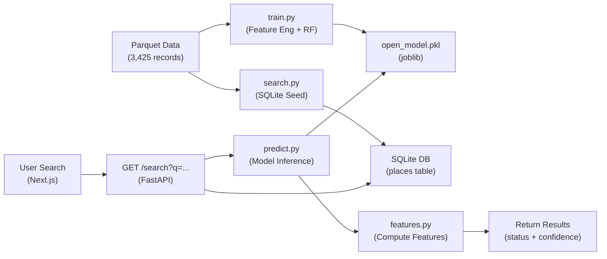

# StillOpen — Project Handoff Report

> **Date**: February 19, 2026
> **Team**: Emilio & Michael (CRWN 102, UCSC)
> **Repo**: `Emilio-portal/Open-Closed-Prediction-Model-Emilio-Michael`

---

## 1. Project Goal

**StillOpen** is a machine learning project that predicts whether real-world businesses and points of interest (POIs) are currently **open or permanently closed** based solely on their **digital metadata** — no user reviews, no scraping of "hours of operation," just structured signals from geospatial datasets.

### Core Problem
In geospatial data (e.g., Overture Maps, OpenStreetMap), the "open/closed" status of businesses is often stale or missing. The project aims to:
1. **Binary Classification** — predict `open` (1) vs `closed` (0) from metadata features
2. **Expose via Web App** — a full-stack "StillOpen" web app where users can search for any business and see the ML prediction with confidence scores and signal explanations
3. **Scalability** — design the pipeline so it could eventually handle 100M+ records (PySpark, XGBoost, PostGIS)

### Class Breakdown
- **CRWN 102** course project at UC Santa Cruz
- Emilio and Michael are collaborating; Michael built the web app scaffold, Emilio is experimenting with model improvements on a forked repo

---

## 2. Data Overview

| Property | Value |
|---|---|
| **Dataset** | `data/project_c_samples.parquet` (753 KB) |
| **Records** | 3,425 rows |
| **Columns** | 16 (id, geometry, bbox, type, version, sources, names, categories, confidence, websites, socials, emails, phones, brand, addresses, open) |
| **Target** | `open` — binary (1=open, 0=closed) |
| **Class Balance** | **91% open, 9% closed** — heavily imbalanced |
| **Notable Nulls** | `emails` (100% null), `brand` (83% null), `socials` (18% null), `websites` (11% null) |

A pre-cleaned version also exists at `data/project_c_cleaned.parquet` (generated by `src/data_preparation.py`), which flattens nested structures into simple columns.

---

## 3. Repository Structure

```
Open-Closed-Prediction-Model-Emilio-Michael/
├── data/
│   ├── project_c_samples.parquet     # Raw data (3,425 records)
│   └── project_c_cleaned.parquet     # Pre-cleaned flat version
├── src/                              # Original standalone ML scripts
│   ├── train_open_model.py           # Primary open/closed classifier (RF + GBM)
│   ├── train_model.py                # Category NLP + confidence regression
│   ├── data_preparation.py           # Cleans parquet → flat parquet
│   ├── read_parquet.py               # Export utility (parquet → JSON/CSV)
│   └── debug_features.py            # Feature diagnostics
├── stillopen/                        # Full-stack web application
│   ├── backend/
│   │   ├── app/
│   │   │   ├── main.py               # FastAPI entry point (CORS, routes, startup)
│   │   │   ├── predict.py            # Model loading + inference service
│   │   │   ├── features.py           # Feature engineering (single-record)
│   │   │   ├── search.py             # SQLite search + data seeding
│   │   │   ├── database.py           # SQLAlchemy engine (SQLite for local)
│   │   │   └── models.py             # Pydantic schemas + SQLAlchemy models
│   │   ├── model/
│   │   │   └── open_model.pkl        # Trained model + artifacts (joblib)
│   │   ├── scripts/
│   │   │   └── train.py              # Training script that outputs open_model.pkl
│   │   ├── requirements.txt
│   │   └── MIGRATION.md              # PostgreSQL/PostGIS migration guide
│   └── frontend/                     # Next.js 15 + Tailwind 4 + Framer Motion
│       ├── src/
│       │   ├── app/
│       │   │   ├── page.tsx           # Homepage with hero search
│       │   │   ├── search/page.tsx    # Search results page
│       │   │   └── place/[id]/page.tsx # Place detail page
│       │   ├── components/
│       │   │   ├── SearchBar.tsx      # Live search with debounced dropdown
│       │   │   ├── SearchResults.tsx  # Full results list
│       │   │   ├── ResultCard.tsx     # Detailed place card (status, confidence, explanation)
│       │   │   ├── StatusBadge.tsx    # Open/Closed/Unknown badges
│       │   │   ├── Navbar.tsx         # Sticky nav with compact search
│       │   │   ├── Logo.tsx           # Brand logo
│       │   │   └── LoadingView.tsx    # Animated loading spinner with messages
│       │   └── lib/
│       │       └── api.ts            # API client (fetch wrappers)
│       ├── package.json
│       └── tsconfig.json
├── requirements.txt                  # Root-level Python deps
└── README.md
```

---

## 4. Architecture & Data Flow



### Key Flow
1. **Training** (`train.py`): Reads parquet → feature engineering → trains RandomForest → saves `open_model.pkl` with model + artifacts (freq_map, label encoder, feature list)
2. **Startup** (`main.py`): Seeds SQLite from parquet, loads model from `.pkl`
3. **Search** (`search.py`): SQLite LIKE query → for each result, runs inference via `predict.py`
4. **Inference** (`predict.py` → `features.py`): Computes features from raw metadata → runs model → returns `{status, confidence, explanation}`
5. **Frontend**: Next.js calls FastAPI → renders results with StatusBadge and ResultCard

---

## 5. Current Model Performance

### Model: Random Forest (current production model in `open_model.pkl`)
Trained on the entire dataset (no test split in the serving script, but evaluated previously):

| Metric | Random Forest | Gradient Boosting |
|---|---|---|
| **Accuracy** | 84.1% | 90.2% |
| **ROC-AUC** | 0.687 | 0.681 |
| **F1 (class 1, open)** | 0.91 | 0.95 |
| **Recall (class 0, closed)** | **0.33** ⚠️ | **0.11** ⚠️ |
| **Precision (class 0, closed)** | 0.24 | 0.39 |

### Feature Importance (Random Forest)
1. `category_freq_score` — 24.2%
2. `confidence` — 18.5%
3. `category_label` — 18.2%
4. `source_mean_confidence` — 14.5%
5. `days_since_last_update` — 13.5%
6. `has_phone` — 3.1%
7. `has_website` — 2.7%
8. `has_brand` — 2.1%
9. `num_sources` — 2.0%
10. `has_social` — 1.3%
11. `has_email` / `has_address` — 0.0%

> [!CAUTION]
> **The model is heavily biased toward predicting "open"** due to the 91/9 class imbalance. It struggles badly at detecting closed businesses (only catches 11-33% of them). Accuracy is misleading — a naive model predicting "always open" gets 91%.

---

## 6. Known Issues & Gaps

### Model Issues
1. **Class imbalance** — 91% open / 9% closed. The model rarely predicts "closed"
2. **Low minority-class recall** — Only catches 11-33% of actually closed businesses
3. **`class_weight='balanced'`** is set in RF but clearly not enough
4. **No cross-validation** — Single train/test split used for evaluation
5. **Training script (`train.py`) fits on entire dataset** — No held-out test evaluation

### Backend Issues
1. **Backend was written for PostgreSQL/PostGIS** but was adapted to SQLite for local dev. The migration back to PostgreSQL is documented in `MIGRATION.md` but hasn't been tested
2. **Search is basic SQLite LIKE** — no fuzzy matching or ranking (PostgreSQL version would use `pg_trgm`)
3. **Prediction runs on every search result** — this is slow for large result sets (should be cached or batched)
4. **No error handling** for malformed metadata during inference

### Frontend Issues
1. **`package.json` and `tsconfig.json` were missing from git** — they were recreated manually
2. **No environment variable handling** for API URL in production
3. **LoadingView component exists but isn't used** in the current flow

### Data Issues
1. **`emails` column is 100% null** — contributes nothing as a feature
2. **`has_email` and `has_address`** have zero feature importance — they could be removed
3. **Small dataset** (3,425 records) — need more data for robust training

---

## 7. Recommended Improvements

### Priority 1: Fix Model Performance
- **SMOTE / oversampling** the minority class (closed businesses)
- **Threshold tuning** — adjust the classification threshold from 0.5 to optimize F1 on the minority class
- **Cost-sensitive learning** — increase `sample_weight` or use `class_weight` with custom ratios
- **XGBoost or LightGBM** with `scale_pos_weight` parameter — significantly better for imbalanced datasets
- **Stratified K-Fold cross-validation** — get more robust performance estimates

### Priority 2: Better Feature Engineering
- **Count-based features** instead of just binary: `num_websites`, `num_phones`, `num_socials`
- **Name-based features**: name length, presence of keywords ("closed", "former", "coming soon")
- **Interaction features**: `has_website AND has_social`, `num_sources * source_mean_confidence`
- **Temporal features**: weekend/weekday of last update, time-since-first-source
- **Drop useless features**: `has_email` (100% null), `has_address` (zero importance)

### Priority 3: Expand Dataset
- Ingest more data from Overture Maps or OpenStreetMap
- The PostgreSQL/PostGIS migration (MIGRATION.md) enables large-scale OSM data ingestion
- Target dataset size: 50K-100K+ records for meaningful model training

### Priority 4: Web App Polish
- Implement the PostgreSQL migration when ready for production
- Add geospatial "Near Me" search using PostGIS `ST_DWithin`
- Cache predictions to avoid recomputing for every search result
- Use the `LoadingView` component on the place detail page
- Add a map view with markers colored by open/closed status

---

## 8. How to Run Locally

### Backend
```bash
cd stillopen/backend
pip install -r requirements.txt  # (remove psycopg2-binary, geoalchemy2 for SQLite mode)
python3 -m uvicorn app.main:app --reload --port 8000
```
The API auto-seeds SQLite from the parquet data on first start.

### Model Training
```bash
# From project root:
python3 stillopen/backend/scripts/train.py
# Outputs: stillopen/backend/model/open_model.pkl
```

### Frontend
```bash
cd stillopen/frontend
npm install
npm run dev
# Runs at http://localhost:3000
```

### Standalone Model Evaluation
```bash
cd <project_root>
python3 src/train_open_model.py
```

---

## 9. Key Files for Any Agent

If you're an AI agent picking up this project, read these files in this order:
1. `README.md` — project overview
2. `data/project_c_samples.parquet` — the raw data (read with `pd.read_parquet()`)
3. `src/train_open_model.py` — original model training with full evaluation metrics
4. `stillopen/backend/app/features.py` — the feature engineering pipeline
5. `stillopen/backend/scripts/train.py` — the web app's model training script
6. `stillopen/backend/app/search.py` — data seeding and search logic
7. `stillopen/backend/app/predict.py` — model inference service
8. `stillopen/frontend/src/components/SearchBar.tsx` — main UI interaction

---

## 10. Tech Stack Summary

| Layer | Technology |
|---|---|
| **ML Model** | scikit-learn (RandomForestClassifier) |
| **Model Serving** | joblib (pickle) |
| **Backend API** | FastAPI (Python 3.11+) |
| **Database (local)** | SQLite via SQLAlchemy |
| **Database (prod)** | PostgreSQL + PostGIS (planned) |
| **Frontend** | Next.js 15 + React 19 + TypeScript |
| **Styling** | Tailwind CSS 4 |
| **Animations** | Framer Motion |
| **Icons** | Lucide React |
| **Data Format** | Apache Parquet (via pyarrow) |
